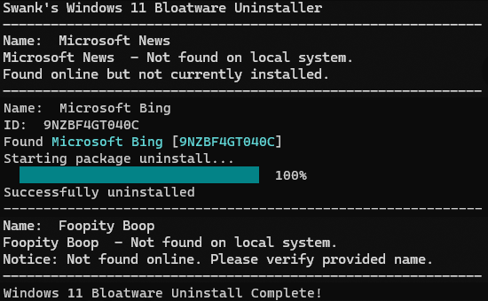
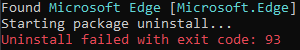
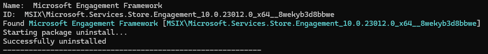

# Win11_bloatwareUninstaller

  

## Description
Powershell tool for removing Windows 11 bloatware

## Instructions
1. Not Digitally Signed:

    * Open terminal with admin autorization. (Right-click & Run as administrator)
    * Run `Set-ExecutionPolicy -ExecutionPolicy Unrestricted -Scope LocalMachine`

> [!NOTE]
> You can learn about Windows PowerShell Policies here:  
> https://learn.microsoft.com/en-us/powershell/module/microsoft.powershell.security/set-executionpolicy

 2. Usage (a or b):

    * a. Run Script as default
      * (Right-click & Run with Powershell)

    * b. Edit script to uninstall only the programs you want to remove
      * Modify `$bloatArray` using an editor such as [Notepad++](https://notepad-plus-plus.org/).
      * Save & Run script
      
## Schedule & Automate
> *Coming Soon!*

## Active directory Setup (System Admin)
> *Coming Soon!*

## Known Issues

#### Microsoft Edge:
>   
> *Edge currently has additional protections to prevent uninstall. May include workaround in the future.*

#### Microsoft Engagement Framework:
>   
> *Engagement Framework will report as uninstalled but not actually be removed. Planning to investigate.*
